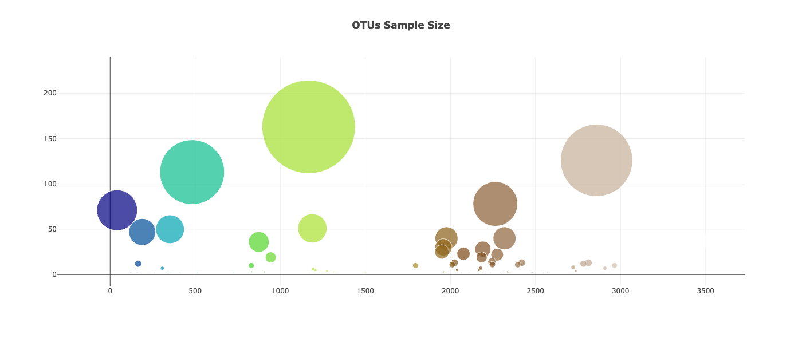

# Belly-Button-Challenge

In the following challenge I built an interactive dashboard analyzing Belly Button Biodeiversity dataset. More specifically I looked at mircobes called operational taxonomic unites (OTUs) that live in the human navel.

Firstly I imported the data using the url through d3 library. Next, I created a horizontal bar chart with the top 10 OTUs found and there sample sizes present in a selected individual . I also included hovertext displaying the OTU label. Here's an image for ID: 940:

Secondly, I created a bubble chart looking at all OTUs and there sample sizes present in an individual. The marker size it determined by OTUs sample size, the greater the sample size of the OTU the bigger the marker(bubble). I also included hovertext displaying the OTU label. Here's an image for ID: 940:

Thirdly, I displayed the sample metadata for the selected individual. Here's an image for ID: 940:

Forthly, I created a dropdown menu with all Ids available for selection. Once an ID is selected all the above charts and displays change to corresponding ID data. Here's an image of dropdown menu:

Lastly, I created a gauge chart display an individual's belly button wash frequency and chart changes based on Id selected. Here's an image for ID: 940.
 
 
